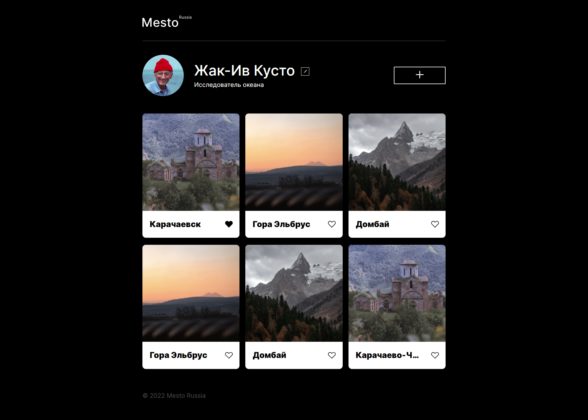

# Проект Mesto

## Содержание

- [Обзор](#Обзор)
  - [Задание](#Задание)
  - [Скриншот](#Скриншот)
  - [Ссылки](#Ссылки)
- [Мой процесс](#Мой-процесс)
  - [Построен с](#Построен-с)
  - [Чему я научился](#Чему-я-научился)
  - [Что хочу изучить](#Что-хочу-изучить)
- [Автор](#Автор)

## Обзор

### Задание

- Сверстать сайт
- Написать часть логики формы редактирования профиля на JavaScript

### Скриншот

### Ссылки

- [Reposotory URL](https://github.com/Zhdko/mesto)
- [GITpages URL](https://zhdko.github.io/mesto/)

## Мой процесс

### Построен с

- Семантическая разметка HTML5
- Пользователские свойства CSS
- Flexbox
- Grid
- Desctop-first workflow
- JavaScript

### Чему я научился

  - Изменять свойста svg файлов
  - Прописать легчкую логику JS

### Что хочу изучить

  - Анимация SVG
  - Больше JS
  - Git на более продвинутом уровне

## Автор

- Александр Жданко - [https://github.com/Zhdko](https://github.com/Zhdko)

